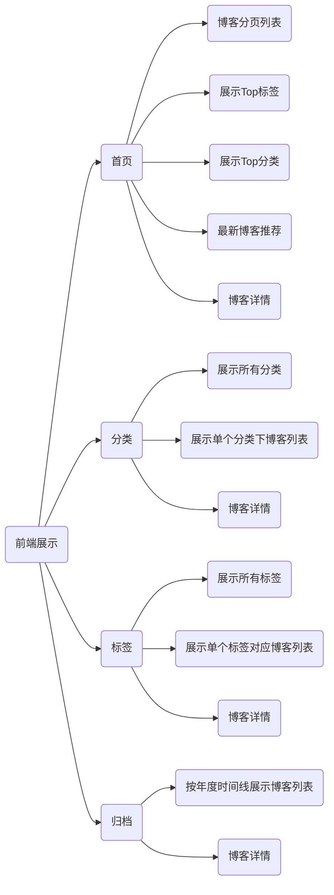

```mermaid
graph LR
 A(前端展示)
    A -->B(首页)
     B -->1(博客分页列表)
     B -->2(展示Top标签)
     B -->3(展示Top分类)
     B -->4(最新博客推荐)
     B -->5(博客详情)
    A -->C(分类)
     C -->Z(展示所有分类)
     C -->Y(展示单个分类下博客列表)
     C -->X(博客详情)
    A -->D(标签)
     D -->H(展示所有标签)
     D -->I(展示单个标签对应博客列表)
     D -->J(博客详情)
    A -->E(归档)
     E -->O(按年度时间线展示博客列表)
     E -->P(博客详情)
   
```

前端展示：首页、详情页、分类、标签、归档、关于我

