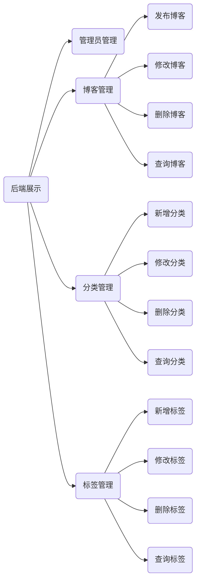

```mermaid
graph LR
 A(后端展示)
    A -->B(管理员管理)
    A -->C(博客管理)
         C -->Z(发布博客)
         C -->Y(修改博客)
         C -->X(删除博客)
         C -->U(查询博客)
    A -->D(分类管理)
         D -->H(新增分类)
         D -->I(修改分类)
         D -->J(删除分类)
         D -->K(查询分类)
    A -->E(标签管理)
         E -->O(新增标签)
         E -->P(修改标签)
         E -->Q(删除标签)
         E -->R(查询标签)
```

