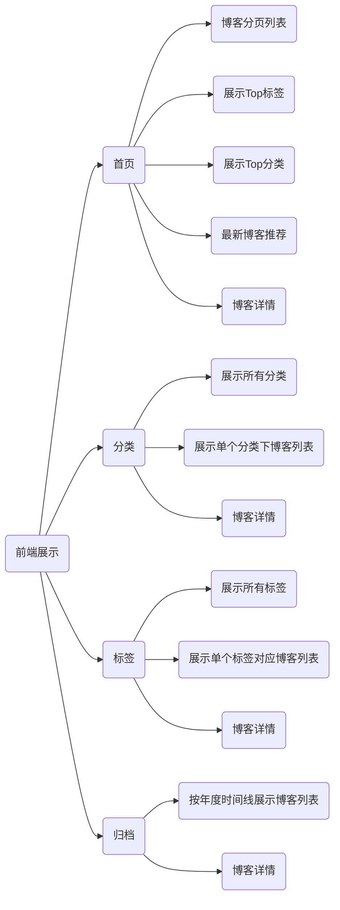
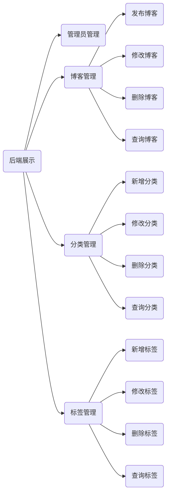

# 角色：访客，管理员（admin，我）

-  **访客**、可以分页查看所有博客（前期必要）

- **访客**、可以快速查询博客数最多的6个大类（前期必要）

- **访客**、可以查找所有大类（前期必要）

- **访客**、可以查看某个分类下的博客列表（前期必要）

- **访客**、可以快速查找标记博客最多的10个标签（前期必要）

- **访客**、可以查看所有的标签（前期必要）

- **访客**、可以查看某个标签下的博客列表

- **访客**、可以可以根据年度时间线查看博客列表

- **访客**、可以快速查看最新的推荐博客

- **访客**、可以用关键字全局搜索博客

- **访客**、可以可以查看单个博客内容

- **访客**、可以对博客内容进行评论

- **访客**、可以点赞或点灭博客内容

- **访客**、可以微信扫描阅读博客内容（前期非必要）

- **访客**、可以在首页扫描公众号二维码关注我（前期非必要）

- *我*、可以用户名和密码登陆后台管理

  

- *我*、可以管理博客

  - *我*、可以发布博客

  - *我*、可以对博客进行分类

  - *我*、可以对博客打标签

  - *我*、可以修改博客

  - *我*、可以删除博客

  - *我*、可以根据标题，分类，标签查询博客

    

- *我*、可以管理博客分类

  - *我*、可以新增一个分类
  - *我*、可以删除一个分类
  - *我*、可以修改一个分类
  - *我*、可以根据分类名称查询分类

- *我*、可以管理标签
  - *我*、可以新增一个标签
  - *我*、可以删除一个标签
  - *我*、可以修改一个标签
  - *我*、可以根据名称查询标签

前端展示：首页、详情页、分类、标签、归档、关于我

后台管理：
